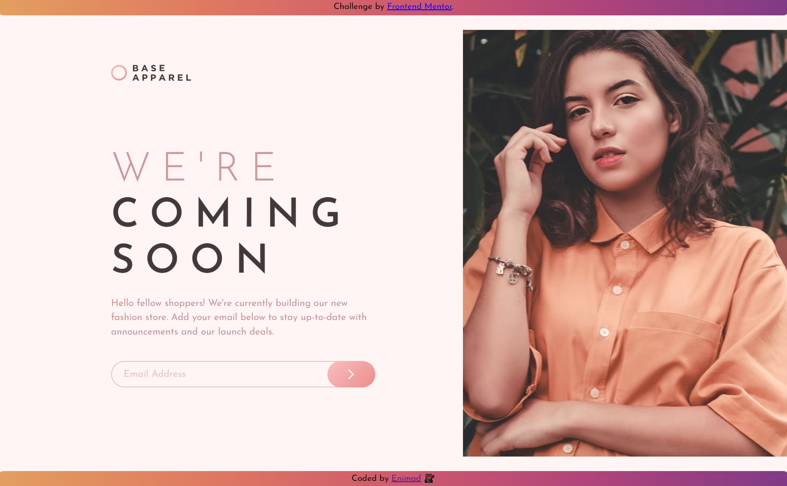

# Frontend Mentor - Base Apparel coming soon page solution

This is a solution to the [Base Apparel coming soon page challenge on Frontend Mentor](https://www.frontendmentor.io/challenges/base-apparel-coming-soon-page-5d46b47f8db8a7063f9331a0). Frontend Mentor challenges help you improve your coding skills by building realistic projects. 

## Table of contents

- [Overview](#overview)
  - [Screenshot](#screenshot)
  - [Links](#links)
  - [Built with](#built-with)

## Overview

This challenge is to build out a coming soon page and get it looking as close to the design as possible.
### Screenshot of my solution

### Links

- Solution URL: [https://github.com/enimad/Base-apparel-coming-soon-master]
- Live Site URL: [https://enimad.github.io/Base-apparel-coming-soon-master/]

### Built with

- Semantic HTML5 markup
- CSS custom properties
- Sass preprocessor
- Flexbox
- Mobile-first workflow